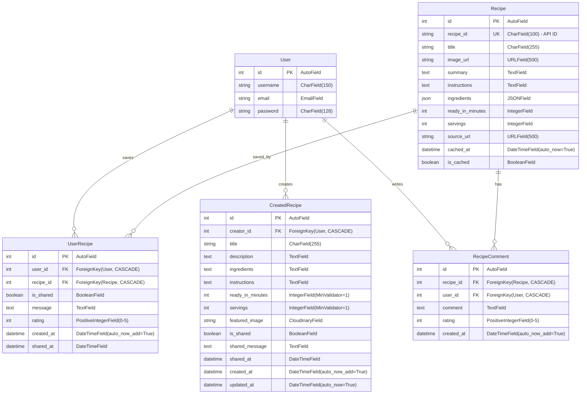

# Recipe Room Database ERD

## Entity Relationship Diagram

## Relationships

### User (Django Auth)
- **One-to-Many** with UserRecipe: A user can save multiple API recipes
- **One-to-Many** with CreatedRecipe: A user can create multiple recipes
- **One-to-Many** with RecipeComment: A user can write multiple comments

### Recipe (API Cache)
- **One-to-Many** with UserRecipe: A recipe can be saved by multiple users
- **One-to-Many** with RecipeComment: A recipe can have multiple comments
- **Unique Constraint**: `recipe_id` (Spoonacular API identifier)

### UserRecipe (Junction Table)
- **Many-to-One** with User: Links to the user who saved the recipe
- **Many-to-One** with Recipe: Links to the saved recipe
- **Unique Together**: (user, recipe) - Prevents duplicate saves
- **Cascade Delete**: Deletes when User or Recipe is deleted

### CreatedRecipe (User-Created)
- **Many-to-One** with User (creator): Links to the recipe author
- **Cascade Delete**: Deletes when creator User is deleted
- **Independent**: Not related to API Recipe model

### RecipeComment
- **Many-to-One** with User: Links to comment author
- **Many-to-One** with Recipe: Links to the commented recipe
- **Cascade Delete**: Deletes when User or Recipe is deleted

## Key Features

- **Rating System**: UserRecipe and RecipeComment support 0-5 star ratings
- **Sharing Mechanism**: Both UserRecipe and CreatedRecipe can be shared to community feed
- **API Caching**: Recipe model caches Spoonacular API data to reduce API calls
- **Image Storage**: CreatedRecipe uses Cloudinary for user-uploaded images
- **Validation**: MinValueValidator and MaxValueValidator for ratings, servings, and time
